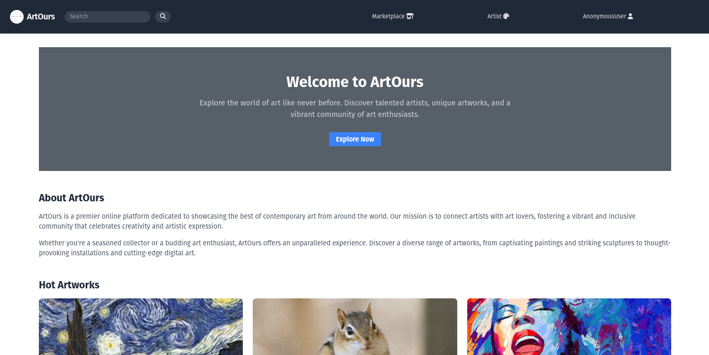
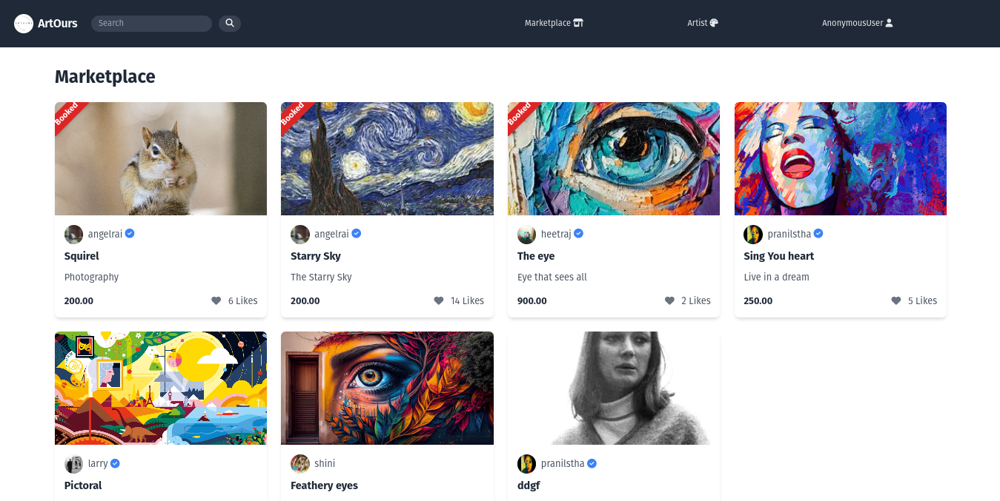
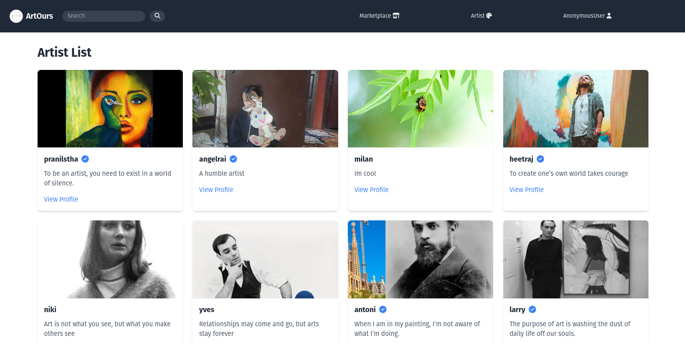

# ArtOurs

ArtOurs is a platform dedicated to connecting artists with customers, providing a space for artists to showcase their talents and offering customers access to quality art and craftworks. Our primary objectives are to facilitate connections between artists and customers, enable artists to showcase their art, provide opportunities for commission works, and ensure a trustworthy platform with minimal fraudulent activities.

## Getting Started

### Prerequisites

- Python 3.10+ installed
- Django installed (`pip install django`)
- A virtual environment (recommended)

### Installation

1. **Clone the Repository:**
   ```bash
   git clone https://github.com/fuunshi/artours.git
   cd artours
   ```

2. **Create a Virtual Environment:**
   ```bash
   python -m venv venv
   source venv/bin/activate  # On Windows use `venv\Scripts\activate`
   ```

3. **Install Dependencies:**
   ```bash
   pip install -r requirements.txt
   ```

### Database Setup

1. **Apply Migrations:**
   ```bash
   python manage.py migrate
   ```

2. **Create a Superuser (optional, for admin access):**
   ```bash
   python manage.py createsuperuser
   ```

### Running the Server

1. **Run the Development Server:**
   ```bash
   python manage.py runserver
   ```

2. **Access the Application:**
   Open your browser and go to `http://127.0.0.1:8000/` to see the home page.

## Objectives

- **Connect Artists and Customers**: ArtOurs aims to bridge the gap between artists and customers, allowing them to connect and collaborate seamlessly.
- **Showcase Artist Talents**: We provide a platform for artists to showcase their art to a wide audience, giving them exposure and recognition for their work.
- **Commission Works**: Artists have the opportunity to offer their services for commission works, enabling customers to request personalized pieces tailored to their preferences.
- **Quality Artworks**: For customers, ArtOurs offers a curated selection of quality art and craftworks, ensuring a diverse range of options to suit different tastes and preferences.
- **Trustworthy Platform**: ArtOurs prioritizes trust and security, implementing measures to minimize fraudulent activities and providing a safe environment for transactions.

## Features

- **Artist Profiles**: Artists can create profiles showcasing their portfolio, bio, and contact information, allowing customers to learn more about them and their work.
- **Art Listings**: Artists can post their paintings, sculptures, crafts, and other artworks for sale, similar to a commerce site, making it easy for customers to browse and purchase.
- **Commission Requests**: Customers can submit commission requests directly to artists, specifying their requirements and preferences for custom artworks.
- **Search and Filter**: Customers can search for specific types of art or artists and filter results based on criteria such as medium, style, and price.
- **Secure Transactions**: ArtOurs ensures secure transactions for both artists and customers, providing payment processing and dispute resolution mechanisms.
- **Rating and Reviews**: Customers can leave ratings and reviews for artists based on their experience, helping to build trust and credibility within the community.

## Screenshots

### Home Page


### Marketplace Page


### Artist Profile Page


## Contributing

We welcome contributions from artists, developers, and enthusiasts who share our passion for art and technology. If you're interested in contributing to ArtOurs, please reach out to us at [collaborate@pranilshrestha.com.np](mailto:collaborate@pranilshrestha.com.np).
